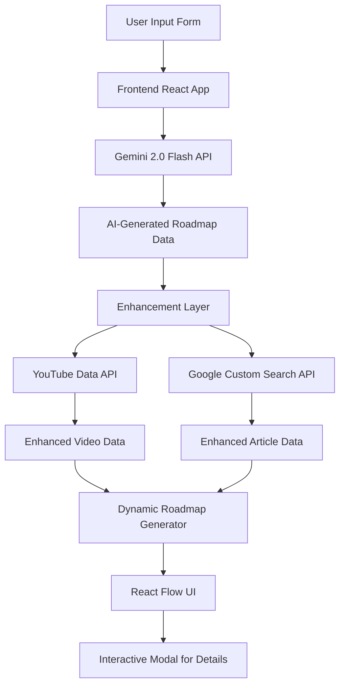

# Adaptive Learning Navigator - ALAN

## Overview

ALAN is an innovative, AI-powered platform designed to create personalized learning Plans for technical subjects. By harnessing the power of Generative AI, and enriching content with resources from YouTube and Google Search, this tool delivers a dynamic and engaging learning experience. The roadmap is presented as an interactive graph using React Flow, allowing users to navigate and delve into learning modules at their own pace.

## Table of Contents

- [Features](#features)
- [Learning Methodology](#learning-methodology)
- [Architecture](#architecture)
- [Technology Stack](#technology-stack)
- [Installation and Setup](#installation-and-setup)
- [Usage](#usage)
- [Deployment](#deployment)
- [Future Enhancements](#future-enhancements)
- [Impact](#impact)
- [License](#license)

## Features

- **Personalized Learning Paths:** Generates custom-designed roadmaps tailored to individual user's experience level (Heard of it, Know about it, Worked with it) and learning preferences for a given topic.
- **AI-Powered Roadmap Design:** Employs Gemini 2.0 Flash LLM to create structured and coherent learning roadmaps, ensuring a logical flow of topics.
- **Curated Learning Resources:** Integrates relevant and specific learning materials:
    - **Topic-Specific Videos:** Fetches relevant videos using YouTube Data API, embedded directly within the interface to minimize distractions.
    - **Relevant Articles:**  Retrieves articles corresponding to each topic using Google Custom Search JSON API, providing diverse perspectives and in-depth information.
- **Structured Content Format:**  Each learning module within the roadmap is designed with a structured format to enhance learning:
    - **Overview:** Provides a concise introduction to the topic, setting the context for the user.
    - **Articles:** Offers curated articles to deepen understanding and promote reading habits.
    - **Videos:** Embeds relevant videos to provide visual and auditory learning resources, keeping users within a single learning environment.
    - **Community Notes:**  Displays comments and feedback from other users, fostering a sense of community and interactivity in learning.
- **Interactive Roadmap UI:** Utilizes React Flow to present the roadmap as a visually appealing and interactive graph, allowing users to:
    - **Navigate Freely:** Explore the roadmap structure and topics at their own pace.
    - **Access Module Details:** Click on any node to open a modal window displaying detailed information about the topic, including overview, articles, videos, and community notes.
    - **Track Progress:** Mark topics as "Completed," visually updating the node color to green, providing a sense of accomplishment.
- **User-Friendly Design:**
    - **Minimalistic and User-Friendly Roadmap:** Focuses on clear and concise presentation, avoiding unnecessary complexity.
    - **Distraction-Free Environment:** Embeds videos and articles within the interface to prevent users from navigating away to other windows.
    - **Responsive UI:** Designed with React for a responsive interface that adapts to various devices and screen sizes.

## Learning Methodology

The AI-Driven Roadmap Generator, codenamed "ALAN," is built upon a user-centric learning methodology designed to personalize and streamline the learning process:

1.  **Input-Driven Personalization:** ALAN begins by gathering essential inputs from the user:
    *   **Learning Topic:** The specific subject area the user wishes to explore.
    *   **Experience Level:**  The user's self-assessed familiarity with the topic, categorized into "Heard of it," "Know about it," and "Worked with it." This allows ALAN to tailor the roadmap's depth and complexity appropriately.

2.  **AI-Powered Roadmap Generation (Behind the Scenes):** Once the inputs are provided, ALAN leverages the power of Gemini 2.0 Flash in the background to:
    *   **Design Custom Roadmaps:**  Generate a structured learning path that is contextually relevant to the chosen topic and aligned with the user's experience level.
    *   **Create Compelling and Minimalistic Roadmaps:**  Focus on delivering user-friendly roadmaps that are easy to navigate and understand, avoiding information overload.
    *   **Provide Definitive Learning Approach:** Offer a clear and structured path, helping users overcome the scattered nature of online learning resources and combat procrastination.

3.  **Explorative and Structured Learning Content:**  To support both structured and explorative learning, ALAN provides:
    *   **Navigation and Exploration:** Users can freely navigate the interactive roadmap graph and click on any node to access its content, fostering curiosity and self-directed learning.
    *   **Structured Content Format (3-Step Learning):**  Each module's content is designed in a highly organized format to guide users through a progressive learning experience:
        *   **Overview:**  Begins with a concise overview to introduce the topic and its relevance.
        *   **Topic-Specific Articles:**  Provides curated articles to encourage in-depth reading and enhance understanding of the core concepts (Promoting Reading Habit!).
        *   **Subject-Specific Videos:** Embeds relevant videos directly within the interface to offer visual learning and maintain a distraction-free learning environment (Promoting Distraction-Free Environment!).
        *   **Community Notes:**  Displays comments and insights from other learners, promoting collaborative learning and providing diverse perspectives (Promoting Learning from Others and Interactivity!).

4.  **Progress Tracking and Gamification:** To enhance user engagement and motivation:
    *   **Completion Tracking:** Users can mark each topic as "Completed" after finishing the 3-step learning process, changing the node color to green for visual progress tracking and a sense of accomplishment.

This methodology aims to create a personalized, engaging, and effective learning experience by combining the power of AI with structured content delivery and user-friendly interaction design.

## Architecture

The project architecture emphasizes modularity, scalability, and a clear separation of concerns to ensure maintainability and future enhancements:

1.  **User Interface (Frontend):**
    *   **Technology:** React, React Flow
    *   **Responsibility:**  Handles user interaction, input collection, roadmap visualization using React Flow, and displaying module details in interactive modals. Built as a responsive interface to ensure accessibility across devices.

2.  **Learning Engine (Backend/AI Service):**
    *   **Technology:** Gemini 2.0 Flash (via Google Generative AI SDK)
    *   **Responsibility:** The core intelligence of the system. Uses a transformer-based LLM to:
        *   Generate custom-designed roadmaps based on user inputs (topic and experience level).
        *   Design the roadmap structure, including module titles, overviews, and logical flow (children nodes).

3.  **Enhancement Layer (Data Enrichment Services):**
    *   **YouTube Data API:**
        *   **Responsibility:** Fetches topic-specific and relevant videos to enrich each learning module with visual content.
    *   **Google Custom Search JSON API:**
        *   **Responsibility:** Retrieves relevant articles corresponding to each module's topic, providing text-based learning resources.
    *   **Enhancement Layer Logic:** This layer is responsible for fetching and processing data from external APIs, ensuring that the articles and videos are relevant, specific, and non-distracting to the user, enhancing the learning experience within the web-page itself.

4.  **Data Storage (In Progress):**
    *   **Technologies (Planned):** PostgreSQL, Redis Cache, Vector Store
    *   **Responsibility (Future):**  To store user progress, preferences, potentially cached roadmap data, and vector embeddings for enhanced content retrieval and personalization in future iterations. Currently, the application is designed to be stateless for simplicity in the prototype phase, but data persistence is planned for future scalability.

5.  **Dynamic Roadmap Generator (Utility Layer):**
    *   **Responsibility:** Orchestrates the entire roadmap generation process.
        *   Combines the AI-generated roadmap structure from Gemini with enhanced video and article data from external APIs.
        *   Constructs the node and edge data structures required by React Flow for visualization.
        *   Applies a layout algorithm (dagre) to arrange the nodes and edges in a structured and readable flowchart format.

### Architecture Diagram



## Technology Stack

- **Frontend:**
    - React:  For building a component-based, interactive, and responsive user interface.
    - React Flow: For creating and rendering the interactive roadmap graph.
    - Mermaid: For generating diagrams within the README and potentially within the application in future enhancements.
- **Backend/AI Service:**
    - Gemini 2.0 Flash: Powered by Google Generative AI for generating the roadmap structure.
- **APIs:**
    - YouTube Data API: For fetching video content.
    - Google Custom Search JSON API: For retrieving relevant articles.
- **Databases (In Progress):**
    - PostgreSQL: For persistent data storage (user profiles, saved roadmaps - future).
    - Redis Cache: For caching frequently accessed data to improve performance (future).
    - Vector Store: For storing vector embeddings for advanced content recommendation and personalization (future).
- **Deployment:**
    - Vercel: For hosting the frontend application, providing scalability and ease of deployment.

## Installation and Setup

1.  **Clone the Repository:**

    ```bash
    git clone https://github.com/yourusername/your-repo.git
    cd your-repo
    ```

2.  **Install Dependencies:**

    ```bash
    npm install
    ```

3.  **Configure Environment Variables:**
    Create a `.env` file in the root directory with the following API keys:

    ```ini
    REACT_APP_GEMINI_KEY=your_gemini_key_here
    REACT_APP_YOUTUBE_KEY=your_youtube_key_here
    REACT_APP_SEARCH_KEY=your_google_search_key_here
    REACT_APP_CSE_ID=your_custom_search_engine_id_here
    ```
    **Note:** Ensure you have obtained API keys for Gemini, YouTube Data API, and Google Custom Search JSON API and replace the placeholder values with your actual keys.

4.  **Start the Development Server:**

    ```bash
    npm start
    ```

5.  **Access the Application:** Open your browser and navigate to `http://localhost:3000` to use the AI-Driven Roadmap Generator.

## Usage

1.  **Enter Topic and Experience Level:** On the application's homepage, input the technical topic you want to learn about in the provided text field. Select your experience level from the dropdown menu ("Heard of it," "Know about it," or "Worked with it").
2.  **Generate Roadmap:** Click the "Generate Roadmap" button. The application will then use Gemini AI to create a personalized learning roadmap for your chosen topic and display it as an interactive graph using React Flow.
3.  **Explore Roadmap Modules:** The roadmap will be displayed as a series of interconnected nodes. You can pan and zoom within the React Flow interface to navigate the entire roadmap.
4.  **View Module Details:** Click on any node in the roadmap to open a modal window. This modal will contain:
    - **Module Title:** The topic of the learning module.
    - **Overview:** A brief description of the module's content.
    - **Articles:** A list of recommended articles with links for in-depth reading.
    - **Videos:** Embedded relevant videos for visual learning.
    - **Community Notes:**  Comments and tips from other users related to the topic.
5.  **Mark as Completed:**  Once you have completed learning a module, click the "Mark as Completed" button within the modal. This will visually highlight the node as completed in the roadmap.
6.  **Mark to Revisit:** If you wish to revisit a topic later, you can use the "Mark to Revisit" button (functionality to be further enhanced in future versions).
7.  **Close Modal:** Click the "Close" button to close the module details modal and return to the main roadmap view.

## Deployment

This project is designed for easy deployment on Vercel, leveraging its serverless platform for scalability and reliability. To deploy your own instance:

1.  **Push to Git Repository:**  Ensure your project code is hosted on a Git repository (e.g., GitHub, GitLab, Bitbucket).
2.  **Vercel Account:** Sign up or log in to your Vercel account at [https://vercel.com](https://vercel.com).
3.  **Import Repository:** From your Vercel dashboard, import your project repository.
4.  **Configure Environment Variables:** In your Vercel project settings, add the required environment variables (API keys for Gemini, YouTube, Google Search) under the "Environment Variables" section. Ensure the variable names match those in your `.env` file (e.g., `REACT_APP_GEMINI_KEY`).
5.  **Deploy:** Click the "Deploy" button. Vercel will automatically build and deploy your application.
6.  **Access Deployed Application:** Once deployment is complete, Vercel will provide you with a unique URL to access your live AI-Driven Roadmap Generator application.

For more detailed deployment instructions and advanced configurations, refer to the comprehensive [Vercel Documentation](https://vercel.com/docs).

## Future Enhancements

- **Enhanced Content Curation:**
    - Integrate more diverse APIs and content sources (e.g., academic databases, documentation portals, other video platforms) to further enrich learning resources.
    - Implement content filtering and ranking algorithms to ensure the highest quality and most relevant resources are presented.
- **User Account Management:**
    - Implement user authentication and authorization to allow users to create accounts, save personalized roadmaps, track their learning progress across sessions, and share custom roadmaps with others.
- **Advanced Analytics and Insights:**
    - Integrate analytics tools to collect data on user interactions, learning paths, module completion rates, and search queries.
    - Utilize collected data to generate insights for educational institutions and content creators to understand learning patterns and optimize roadmap content.
- **UI/UX Refinements:**
    - Conduct user testing and gather feedback to identify areas for UI/UX improvement.
    - Enhance the responsiveness of the UI across a wider range of devices and screen orientations.
    - Explore advanced React Flow features for more sophisticated roadmap layouts and node interactions.
- **Gamification and Social Learning Features:**
    - Introduce gamification elements like badges, points, and progress leaderboards to increase user engagement and motivation.
    - Enhance social learning features by allowing users to directly interact with community notes, ask questions, and collaborate on learning paths.
- **Google Calendar Integration:**
    - Enable users to integrate their learning roadmap with Google Calendar, scheduling study sessions and setting reminders for each module.
- **Creator Preferences:**
    - Allow users to specify preferred content sources or creators, enabling further customization of learning resources.
- **Support for New Content Types:**
    - Expand content support beyond articles and videos to include interactive exercises, quizzes, code playgrounds, and other engaging learning formats.

## Impact

The AI-Driven Roadmap Generator has the potential to create significant positive impact in education and skills development by:

- **Democratizing Access to Personalized Education:** Making customized learning paths accessible to anyone with an internet connection, regardless of their background or location.
- **Improving Learning Outcomes through AI-Driven Optimization:** Leveraging AI to create effective and efficient learning paths, leading to better knowledge retention and skill acquisition.
- **Reducing Time-to-Skill Acquisition:** Streamlining the learning process by providing a focused and structured approach, helping users learn new skills faster.
- **Enhancing Learner Engagement and Motivation:** Creating a more interactive and engaging learning experience through visual roadmaps, curated content, and community features, increasing user motivation and reducing dropout rates (through visual learning cues).
- **Providing Data-Driven Insights for Educational Institutions:** Offering valuable data on learning trends and user behavior, enabling institutions to optimize curricula and improve educational resource allocation.

## License

[MIT License](LICENSE)

