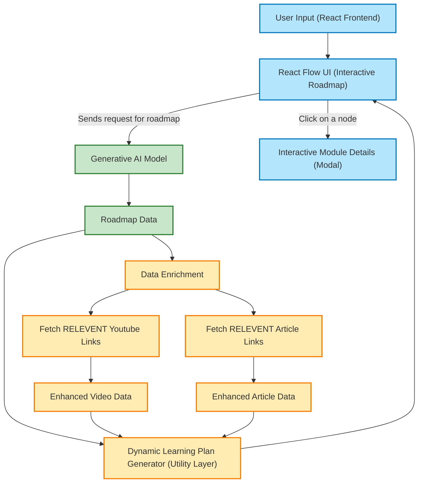

# Adaptive Learning Navigator - ALAN

[](https://opensource.org/licenses/MIT)
[](https://www.repostatus.org/#active)

## Overview

ALAN (Adaptive Learning Navigator) is an innovative, AI-powered learning platform meticulously crafted to generate personalized learning plans for navigating complex technical subjects. Leveraging the cutting-edge capabilities of Generative AI, specifically Gemini 2.0 Flash, and enriching learning content with a vast array of resources from YouTube and Google Search (accessed securely via backend proxies), ALAN delivers a dynamic, engaging, and highly effective learning experience. The generated learning roadmap is visually represented as an interactive graph using React Flow, empowering users to navigate through learning modules at their own pace, fostering a self-directed and deeply engaging educational journey.

## Table of Contents

- [Features](#features)
- [Learning Methodology](#learning-methodology)
- [Architecture](#architecture)
    - [Architecture Diagram](#architecture-diagram)
    - [Component Details](#component-details)
- [Technology Stack](#technology-stack)
    - [Frontend](#frontend)
    - [Backend](#backend)
    - [Deployment](#deployment-tech)
- [Installation and Setup](#installation-and-setup)
    - [Prerequisites](#prerequisites)
    - [Frontend Setup](#frontend-setup)
    - [Backend Setup](#backend-setup)
- [Usage](#usage)
    - [Generating a Learning Roadmap](#generating-a-learning-roadmap)
    - [Exploring the Interactive Roadmap](#exploring-the-interactive-roadmap)
    - [Tracking Learning Progress](#tracking-learning-progress)
- [Deployment](#deployment)
    - [Backend Deployment on Render](#backend-deployment-on-render)
    - [Frontend Deployment on Render or Vercel](#frontend-deployment-on-render-or-vercel)
- [Future Enhancements](#future-enhancements)
    - [Content Curation & Expansion](#content-curation--expansion)
    - [User Account Management](#user-account-management)
    - [Advanced Learning Analytics](#advanced-learning-analytics)
    - [UI/UX Refinements](#uiux-refinements)
    - [Data Persistence & Personalization](#data-persistence--personalization)
- [Impact](#impact)
- [License](#license)
- [Contributing](#contributing)
- [Code of Conduct](#code-of-conduct)
- [Final Steps](#final-steps)

## Features

ALAN is packed with features designed to revolutionize the way you learn technical subjects:

- **Personalized Learning Paths:**  
    ALAN transcends generic learning approaches by generating **custom-designed roadmaps**. These roadmaps are meticulously tailored to your self-assessed **experience level** (ranging from "Heard of it" to "Know about it" to "Worked with it") and your specific **learning preferences** for any given technical topic. This ensures that the learning journey is relevant, appropriately paced, and caters to your individual needs.

- **AI-Powered Roadmap Design (Gemini 2.0 Flash):**  
    At the heart of ALAN is **Gemini 2.0 Flash**, a powerful Generative AI model. It intelligently constructs a **structured and coherent learning roadmap** that not only covers the breadth of the chosen topic but also ensures a **logical and progressive topic flow**. This AI-driven approach guarantees a pedagogically sound learning sequence, guiding users from foundational concepts to more advanced topics in a seamless manner.

- **Secure Content Enrichment via Backend Proxies:**  
    Each module within the learning roadmap is dynamically enriched with highly relevant learning resources, sourced from reputable platforms. This enrichment is facilitated through secure Flask backend proxies, ensuring API keys and sensitive data remain protected:
    - **YouTube Videos:**  Relevant YouTube videos are fetched via a secure Flask proxy interacting with the YouTube Data API. This provides access to a vast library of video tutorials, explanations, and demonstrations, catering to visual learners and those who prefer multimedia content.
    - **Articles:**  Curated articles from across the web are retrieved using a Flask proxy for the Google Custom Search JSON API. This ensures access to diverse perspectives, in-depth explanations, and up-to-date information presented in written format, catering to readers and those who prefer text-based learning.

- **Structured Content Format for Each Learning Module:**  
    To maintain clarity and organization, each learning module within the roadmap adheres to a **structured content format**.  This includes:
    - **Overview:** A concise overview of the module's topic, setting the context and learning objectives.
    - **Curated Resources (Initially Empty):**  Placeholders for arrays of articles and videos, ready to be populated with relevant content dynamically fetched from YouTube and Google Search. This highlights the intention for resource integration, even if initially empty.
    - **Community Notes (Placeholder):** A section reserved for future community contributions, such as notes, tips, or discussions related to the module.
    - **Hierarchical Structure:** A clear indication of the module's position within the overall learning hierarchy, showing relationships to preceding and subsequent modules.

- **Interactive Roadmap UI with React Flow:**  
    The learning roadmap is visualized as an **interactive graph** powered by React Flow, a leading library for creating node-based diagrams in React. This interactive UI offers users:
    - **Pan and Zoom Capabilities:** Allowing users to navigate the roadmap at different levels of detail, exploring the overall structure or zooming in on specific modules.
    - **Clickable Nodes:** Each module is represented as a node that can be clicked to reveal detailed module information in an intuitive modal window.

- **Progress Tracking for Enhanced Motivation:**  
    ALAN incorporates a visual progress tracking system to keep users motivated and informed about their learning journey:
    - **"Completed" Status:** Users can mark modules as "Completed" upon finishing them. This action visually transforms the node color to **green**, providing immediate positive feedback and a sense of accomplishment.
    - **"Mark to Revisit" Status:**  For modules that require further review or reinforcement, users can mark them as "Mark to Revisit." This changes the node color to **dark orange**, serving as a visual reminder to return to these modules later.

- **User-Friendly & Minimalist Design:**  
    ALAN prioritizes a seamless and distraction-free learning experience through its design:
    - **Clean Interface:** A visually clean and uncluttered interface minimizes distractions, allowing users to focus solely on the learning content.
    - **Responsive Design:** The platform is fully responsive, ensuring optimal viewing and interaction across various devices, from desktops to tablets and smartphones.
    - **Engaging Learning Environment:** The combination of interactive visuals, clear structure, and personalized content creates an inherently engaging and motivating learning environment.

## Learning Methodology

ALAN's learning methodology is firmly rooted in a **user-centric approach** to personalized education, focusing on adaptability, engagement, and effective knowledge acquisition:

1. **Input-Driven Personalization:**  
   The learning journey begins with **user input**. Users specify the **technical topic** they wish to learn and honestly assess their **current experience level** (Heard of it, Know about it, Worked with it). This crucial information acts as the foundation for tailoring the entire learning roadmap, ensuring relevance and appropriateness from the outset.

2. **AI-Powered Roadmap Generation (Gemini 2.0 Flash):**  
   Leveraging the power of **Gemini 2.0 Flash**, ALAN generates a **structured learning path** dynamically.  Based on the user's topic and experience level, the AI constructs a roadmap that is not only comprehensive but also **contextually relevant**. This ensures that the learning path is not just a generic outline, but a personalized guide designed to effectively bridge the gap between the user's current knowledge and their learning goals.

3. **Content Enrichment via Secure Backend Proxies:**  
   To make each module rich and actionable, ALAN employs **secure backend proxies** to dynamically enrich the roadmap with high-quality learning resources:
   - **Relevant Videos (YouTube Data API):**  Embedded videos, sourced via the YouTube Data API, provide visual explanations, demonstrations, and alternative perspectives on complex concepts.
   - **Curated Articles (Google Custom Search API):**  Carefully selected articles, fetched using the Google Custom Search API, offer in-depth written content, diverse viewpoints, and up-to-date information, catering to different learning styles and preferences.

4. **Interactive Exploration and Self-Paced Learning:**  
   The roadmap is presented as an **interactive graph**, inviting users to actively engage with the learning material. This interactive visualization empowers users to:
   - **Explore Modules at Their Own Pace:**  Users are not confined to a linear path; they can freely navigate the roadmap, choosing modules that pique their interest or address their immediate learning needs.
   - **Dive Deeper into Content:** By clicking on individual modules, users can access detailed information, including module overviews and (in future iterations) curated learning resources, facilitating a deeper understanding of each topic.

5. **Progress Tracking and Visual Motivation:**  
   ALAN incorporates **visual indicators** to track learning progress and provide continuous motivation:
   - **Node Color Changes:**  As users mark modules as "Completed" or "Mark to Revisit," the corresponding nodes on the roadmap change color. This visual feedback provides **clear, engaging, and immediate reinforcement** of their learning progress, encouraging continued engagement and a sense of accomplishment.

## Architecture

ALAN's architecture is thoughtfully designed with a clear separation of concerns, employing a two-tier structure comprising a **React-based frontend** for user interaction and a **Flask-based backend** for secure data handling and API interactions. This architecture ensures scalability, maintainability, and security.

### Architecture Diagram



### Component Details

- **Frontend (React):**
    - **User Input Form:**  Provides an intuitive interface for users to enter their desired learning topic and select their experience level.
    - **React Flow UI (Interactive Roadmap):**  Visualizes the AI-generated learning roadmap as an interactive graph, allowing for panning, zooming, node selection, and progress tracking.
    - **Interactive Module Details (Modal):** Displays detailed information about each learning module in a modal window when a node is clicked, enhancing user engagement and information accessibility.

- **Backend (Flask):**
    - **Enhancement Layer (Data Enrichment):**  Acts as the core data processing layer, responsible for receiving the AI-generated roadmap data and orchestrating the enrichment process.
    - **YouTube Data API Proxy:**  A secure Flask proxy that handles requests to the YouTube Data API, fetching relevant video resources based on module topics. This proxy protects the YouTube API key and ensures secure communication.
    - **Google Custom Search API Proxy:**  A secure Flask proxy that interacts with the Google Custom Search JSON API to retrieve curated articles related to each module. This proxy similarly safeguards the Google Search API key and manages secure API calls.
    - **Enhanced Video Data & Enhanced Article Data:** Represent the data structures containing the fetched and processed video and article information, ready to be integrated back into the roadmap data.
    - **Dynamic Roadmap Generator (Utility Layer):**  A utility layer within the backend that takes the initial AI-generated roadmap data and the enriched video and article data, combining them to create the final, enhanced roadmap structure that is sent back to the frontend.

- **AI Model (Gemini 2.0 Flash API):**
    - **Gemini 2.0 Flash API:**  The powerful Generative AI model responsible for creating the initial structured learning roadmap based on user input. It ensures a logical flow and comprehensive coverage of the chosen technical topic.
    - **AI-Generated Roadmap Data:**  The raw output from the Gemini 2.0 Flash API, containing the structured learning roadmap in a data format suitable for further processing and visualization.

## Technology Stack

ALAN leverages a modern and robust technology stack, chosen for its efficiency, scalability, and ease of development.

### Frontend

- **React:** A declarative, efficient, and flexible JavaScript library for building user interfaces. React's component-based architecture facilitates the creation of reusable UI elements and enhances maintainability.
- **React Flow:** A powerful React library specifically designed for building interactive node-based graphs and diagrams. It provides the core functionality for visualizing and interacting with the learning roadmap.
- **Mermaid:** A JavaScript-based diagramming and charting tool that uses Markdown-inspired text definitions to generate diagrams. Used for creating the architecture diagram within the README and potentially for other visual aids in the application.

### Backend

- **Flask (Python):** A lightweight and flexible Python web framework. Flask is ideal for building the backend API due to its simplicity, extensibility, and suitability for creating RESTful APIs. Python is also well-suited for data processing and API integrations.
- **Gemini 2.0 Flash API:** Google's state-of-the-art Generative AI model, chosen for its ability to generate coherent and structured text content, making it perfect for creating personalized learning roadmaps.
- **YouTube Data API:**  Used to access YouTube's vast library of video content, allowing ALAN to enrich learning modules with relevant video resources. Access is secured via a Flask proxy.
- **Google Custom Search JSON API:**  Provides access to Google's search engine capabilities, enabling ALAN to fetch curated articles from across the web. Access is also secured via a Flask proxy.

### Deployment Tech

- **Render/Vercel:**  Cloud platforms chosen for their ease of use and efficiency in deploying both frontend and backend applications. Render is used for both backend (as a web service) and frontend (as a static site) deployment, while Vercel is an alternative for frontend static site deployment. These platforms offer features like automatic deployments from Git repositories, SSL certificates, and scalable infrastructure.
- **Gunicorn:** (Used for Backend Deployment on Render) A Python WSGI HTTP server for serving Flask applications. Gunicorn is robust, scalable, and commonly used in production environments.

## Installation and Setup

Follow these detailed steps to get ALAN up and running on your local machine.

### Prerequisites

Before you begin, ensure you have the following installed:

- **Node.js and npm (Node Package Manager):** Required for frontend development and dependency management. Download from [https://nodejs.org/](https://nodejs.org/).
- **Python 3.7+:** Required for backend development. Download from [https://www.python.org/](https://www.python.org/).
- **pip (Python Package Installer):**  Usually comes with Python installations. Ensure it's up to date: `python -m pip install --upgrade pip`.
- **Git:** For cloning the repositories. Download from [https://git-scm.com/](https://git-scm.com/).
- **API Keys:** You will need API keys for:
    - **Gemini API Key:** Obtain from [Google AI Studio](https://makersuite.google.com/app/apikey).
    - **YouTube Data API v3 Key:** Obtain from [Google Cloud Console](https://console.cloud.google.com/apis/library/youtube.googleapis.com).
    - **Google Custom Search JSON API Key:** Obtain from [Google Cloud Console](https://console.cloud.google.com/apis/library/customsearch.googleapis.com).
    - **Google Custom Search Engine ID (CSE ID):** Create a Custom Search Engine at [https://programmablesearchengine.google.com/controlpanel/create](https://programmablesearchengine.google.com/controlpanel/create) and get the CSE ID.

### Frontend Setup

1. **Clone the Frontend Repository:**
   ```bash
   git clone <frontend_repository_url>
   cd <frontend_repository_directory>
   ```
   Replace `<frontend_repository_url>` and `<frontend_repository_directory>` with the actual repository URL and desired directory name.

2. **Install Dependencies:**
   ```bash
   npm install
   ```
   This command installs all necessary frontend dependencies listed in `package.json`.

3. **Configure Environment Variables:**
   - Create a `.env` file in the root of your frontend directory if it doesn't exist.
   - Add the following environment variables to `.env`, replacing placeholders with your actual values:
     ```ini
     REACT_APP_BACKEND_URL=http://localhost:5000  # Or your deployed backend URL if backend is not local
     REACT_APP_GEMINI_KEY=<your_gemini_key_here> # Only needed if calling Gemini directly from frontend (not recommended for production)
     ```
     **Note:** For security reasons, it's highly recommended to call the Gemini API from the backend proxy instead of directly from the frontend, especially for production deployments. If you are using the backend proxy for Gemini, you might not need `REACT_APP_GEMINI_KEY` in the frontend `.env`.

4. **Start the Development Server:**
   ```bash
   npm start
   ```
   This command starts the React development server. The frontend application should now be accessible in your browser, typically at `http://localhost:3000`.

### Backend Setup

1. **Clone the Backend Repository:**
   ```bash
   git clone <backend_repository_url>
   cd <backend_repository_directory>
   ```
   Replace `<backend_repository_url>` and `<backend_repository_directory>` with the actual repository URL and desired directory name.

2. **Install Dependencies:**
   ```bash
   pip install -r requirements.txt
   ```
   This command installs all Python backend dependencies listed in `requirements.txt`. It's recommended to use a virtual environment (e.g., `venv`) to manage dependencies in isolation.

3. **Configure Environment Variables:**
   - Create a `.env` file in the root of your backend directory if it doesn't exist.
   - Add the following environment variables to `.env`, replacing placeholders with your actual API keys and IDs:
     ```ini
     GEMINI_KEY=<your_gemini_key_here>
     GEMINI_API_URL=https://generativeai.googleapis.com/v1beta1/models/gemini-2.0-flash:generateText
     YOUTUBE_KEY=<your_youtube_api_key_here>
     SEARCH_KEY=<your_google_search_key_here>
     CSE_ID=<your_custom_search_engine_id_here>
     ```

4. **Run the Backend Locally:**
   ```bash
   python app.py
   ```
   This command starts the Flask backend server. The backend API should now be running, typically at `http://localhost:5000`.

## Usage

Once you have both the frontend and backend set up and running, you can start using ALAN to create personalized learning roadmaps.

### Generating a Learning Roadmap

1. **Enter a Topic and Experience Level:**
   - Open the ALAN frontend application in your browser (usually `http://localhost:3000`).
   - On the homepage, you will find an input form. Enter the **technical topic** you want to learn about in the topic field.
   - Select your **experience level** from the dropdown menu (Heard of it, Know about it, Worked with it).

2. **Generate Roadmap:**
   - Click the "Generate Roadmap" button.
   - The frontend will send a request to the backend, which in turn will use the Gemini API to generate a learning roadmap based on your input.
   - The backend will then enrich the roadmap modules with video and article data using the YouTube and Google Search APIs.
   - The generated and enriched roadmap data will be sent back to the frontend.

### Exploring the Interactive Roadmap

1. **Interactive Navigation:**
   - Once the roadmap is generated, it will be displayed as an interactive graph using React Flow.
   - **Pan and Zoom:** Use your mouse or trackpad to pan around the roadmap and zoom in/out to explore different parts of the learning path.
   - **Node Interaction:** Each module in the roadmap is represented as a node.

2. **View Module Details:**
   - **Click on a Node:** Click on any node in the roadmap to open a modal window.
   - **Module Information:** The modal will display detailed information about the selected module, including:
     - **Overview:** A brief description of the module's topic.
     - **Resources (Future):** In future versions, this section will display curated YouTube videos and articles relevant to the module.
     - **Community Notes (Future):** A placeholder for community-contributed notes and discussions.

### Tracking Learning Progress

1. **Mark as Completed:**
   - In the module details modal or (in future UI improvements) directly on the node, you will find a "Mark as Completed" button or similar control.
   - Click this button when you have finished studying the module.
   - The node color will change to **green** to visually indicate completion.

2. **Mark to Revisit:**
   - If you want to revisit a module later for review or further study, use the "Mark to Revisit" button or control.
   - Click this button.
   - The node color will change to **dark orange** to remind you to revisit this module.

3. **Visual Progress Overview:**
   - The color-coded roadmap provides a quick visual overview of your learning progress. Green nodes represent completed modules, dark orange nodes are marked for revisit, and default colored nodes are modules yet to be completed or marked.

## Deployment

Deploy ALAN to make it accessible online. The following sections outline deployment steps for Render, but you can adapt these steps for other platforms like Vercel, Netlify, or AWS.

### Backend Deployment on Render

1. **Push Backend Code to GitHub:**
   - Ensure your backend code is pushed to a GitHub repository.

2. **Create a New Web Service on Render:**
   - Go to [Render Dashboard](https://dashboard.render.com/) and click "New Web Service."
   - Connect your GitHub repository containing the backend code.

3. **Configure Render Settings:**
   - **Environment:** Choose Python 3.
   - **Build Command:** `pip install -r requirements.txt`
   - **Start Command:** `gunicorn app:app --bind 0.0.0.0:$PORT`
   - **Instances:** Choose an instance type suitable for your needs (e.g., Free or Starter).

4. **Set Environment Variables in Render:**
   - Under "Environment" in your Render web service settings, add the following environment variables, using the same keys and values you used in your local `.env` file:
     - `GEMINI_KEY`
     - `GEMINI_API_URL`
     - `YOUTUBE_KEY`
     - `SEARCH_KEY`
     - `CSE_ID`

5. **Deploy:**
   - Click "Create Web Service" (or "Save Changes" if editing an existing service).
   - Render will automatically build and deploy your backend application. You will get a `.onrender.com` URL once deployed successfully.

### Frontend Deployment on Render or Vercel

**Deployment on Render (as Static Site):**

1. **Push Frontend Code to GitHub:**
   - Ensure your frontend code is pushed to a GitHub repository.

2. **Create a New Static Site on Render:**
   - Go to [Render Dashboard](https://dashboard.render.com/) and click "New Static Site."
   - Connect your GitHub repository containing the frontend code.

3. **Configure Render Settings:**
   - **Build Command:** `npm install && npm run build`
   - **Publish Directory:** `build`
   - **Instances:** Choose an instance type (e.g., Free or Starter).

4. **Set Environment Variable in Render:**
   - Under "Environment" in your Render static site settings, add the following environment variable:
     - `REACT_APP_BACKEND_URL`: Set this to the URL of your deployed backend application on Render (e.g., `https://your-backend-app.onrender.com`).

5. **Deploy:**
   - Click "Create Static Site" (or "Save Changes").
   - Render will build and deploy your frontend application as a static site. You will get a `.onrender.com` URL for your frontend.

**Deployment on Vercel (as Static Site):**

1. **Push Frontend Code to GitHub:**
   - Ensure your frontend code is pushed to a GitHub repository.

2. **Create a New Project on Vercel:**
   - Go to [Vercel Dashboard](https://vercel.com/) and click "Add New Project."
   - Import your GitHub repository containing the frontend code.

3. **Configure Vercel Settings:**
   - Vercel usually auto-detects React projects. If needed, set:
     - **Build Command:** `npm install && npm run build`
     - **Output Directory:** `build`

4. **Set Environment Variable in Vercel:**
   - Under "Environment Variables" in your Vercel project settings, add:
     - `REACT_APP_BACKEND_URL`: Set this to the URL of your deployed backend application (e.g., your Render backend URL or another backend URL).

5. **Deploy:**
   - Click "Deploy."
   - Vercel will build and deploy your frontend application. You will get a `vercel.app` URL for your frontend.

**After deploying both frontend and backend, ensure you update `REACT_APP_BACKEND_URL` in your frontend deployment settings to point to your live backend URL.**

## Future Enhancements

ALAN is envisioned as a continuously evolving platform. Future enhancements are planned to further enrich the learning experience and expand its capabilities:

### Content Curation & Expansion

- **Expand API Integrations:** Integrate with more content platforms beyond YouTube and Google Search, such as educational platforms (Coursera, edX), documentation sites (MDN Web Docs, official documentation), and specialized technical blogs to provide a wider range and depth of learning resources.
- **Automated Content Curation Refinement:** Implement algorithms and potentially user feedback mechanisms to refine the automated content curation process, ensuring higher quality and more relevant resources are suggested for each module.
- **Support for Multiple Content Types:**  Extend support beyond videos and articles to include interactive tutorials, code playgrounds, quizzes, and other engaging content formats to cater to diverse learning preferences.

### User Account Management

- **User Authentication and Profiles:** Implement user account creation, login, and profile management to enable personalized learning experiences that persist across sessions and devices.
- **Roadmap Saving and Sharing:** Allow users to save generated roadmaps to their profiles and share them with others, fostering collaboration and knowledge sharing within learning communities.
- **Personalized Recommendations:** Based on user learning history, preferences, and progress, provide intelligent recommendations for new topics, modules, or learning resources, further enhancing personalization.

### Advanced Learning Analytics

- **Usage Tracking and Learning Outcome Analysis:** Implement analytics to track user engagement, module completion rates, time spent on modules, and potentially integrate with assessment tools to analyze learning outcomes and identify areas for improvement in roadmap design and content curation.
- **Personalized Progress Reports:** Generate visual progress reports for users, highlighting their learning achievements, areas of strength, and areas needing more focus, providing data-driven insights into their learning journey.
- **Adaptive Roadmap Adjustment:** Based on user performance and feedback, dynamically adjust the learning roadmap in real-time, offering more challenging or foundational modules as needed to optimize the learning path for each individual.

### UI/UX Refinements

- **Enhanced Roadmap Visualization:** Explore advanced graph layout algorithms and interactive features within React Flow to further improve the visual clarity, navigation, and engagement of the learning roadmap.
- **Mobile-First Design Optimization:**  Prioritize mobile responsiveness and optimize the UI/UX specifically for mobile devices to ensure a seamless learning experience on smartphones and tablets.
- **Accessibility Improvements:**  Implement accessibility best practices (WCAG guidelines) to ensure ALAN is usable by people with disabilities, making learning accessible to a wider audience.
- **User Feedback Integration:**  Incorporate mechanisms for users to provide feedback on roadmaps, modules, and resources directly within the platform, enabling continuous improvement based on user experience.

### Data Persistence & Personalization

- **Database Integration:** Integrate a database (e.g., PostgreSQL, MongoDB) to persistently store user data, learning progress, saved roadmaps, and other personalized information.
- **Backend Data Management Enhancements:**  Refine the backend data management layer to efficiently handle user data, roadmap data, and content metadata, ensuring scalability and performance as the platform grows.
- **Offline Access (Future Consideration):** Explore the feasibility of enabling offline access to downloaded roadmaps and learning resources for users who may have limited internet connectivity, further expanding accessibility.

## Impact

ALAN aims to democratize access to personalized education by leveraging the power of AI to construct custom learning paths tailored to individual needs. By making advanced technical subjects more approachable and easier to master, ALAN has the potential to:

- **Enhance Learning Outcomes:** Personalized roadmaps, relevant resources, and interactive engagement can lead to improved knowledge retention, deeper understanding, and better learning outcomes compared to generic learning paths.
- **Increase Accessibility to Technical Education:** By breaking down complex topics into manageable modules and providing tailored guidance, ALAN can make technical education more accessible to individuals from diverse backgrounds and experience levels.
- **Boost Learner Engagement and Motivation:** The interactive and visually engaging roadmap, combined with progress tracking and personalized content, can significantly increase learner engagement and motivation, fostering a more enjoyable and effective learning process.
- **Empower Self-Directed Learning:** ALAN empowers users to take control of their learning journey, exploring topics at their own pace and in a way that aligns with their individual learning styles and goals, promoting self-directed learning and lifelong learning habits.

## License

This project is licensed under the **MIT License**. See the `LICENSE` file in the repository for full license details. This permissive license allows for free use, modification, and distribution, encouraging community contributions and wider adoption of ALAN.

## Contributing

We welcome contributions to ALAN! If you're interested in contributing, please follow these steps:

1. **Fork the repository:** Fork the main ALAN repository to your own GitHub account.
2. **Clone your fork:** Clone your forked repository to your local machine.
3. **Create a branch:** Create a new branch for your feature or bug fix: `git checkout -b feature/your-feature-name` or `git checkout -b fix/bug-fix-name`.
4. **Make your changes:** Implement your feature or bug fix, following the project's coding style and guidelines.
5. **Test your changes:** Ensure your changes are working correctly and don't introduce new issues.
6. **Commit your changes:** Commit your changes with clear and concise commit messages: `git commit -m "Add your feature"`.
7. **Push to your fork:** Push your branch to your forked repository: `git push origin feature/your-feature-name`.
8. **Create a pull request:** Submit a pull request from your branch to the main ALAN repository.

Please ensure your contributions align with the project's goals and maintain a positive and collaborative environment. Refer to the [Code of Conduct](#code-of-conduct) for community guidelines.

## Code of Conduct

We are committed to fostering a welcoming and inclusive community. By participating in this project, you agree to abide by our Code of Conduct. We expect all contributors and users to:

- Be respectful and considerate of others.
- Be inclusive and welcoming to diverse perspectives and backgrounds.
- Avoid discriminatory or harassing behavior.
- Be open to constructive feedback and willing to learn from others.
- Help create a positive and collaborative environment.

Any violations of the Code of Conduct may result in appropriate action, as determined by the project maintainers.

## Final Steps

1. **Deploy the Backend:**
   - Follow the [Backend Deployment on Render](#backend-deployment-on-render) steps to deploy your Flask backend.

2. **Deploy the Frontend:**
   - Follow the [Frontend Deployment on Render or Vercel](#frontend-deployment-on-render-or-vercel) steps to deploy your React frontend, ensuring the `REACT_APP_BACKEND_URL` environment variable is correctly set to your deployed backend URL.

Once both frontend and backend are deployed, ALAN will be live and accessible via your frontend application URL, ready to empower personalized learning journeys!
